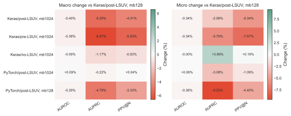
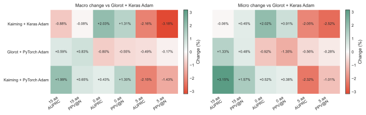
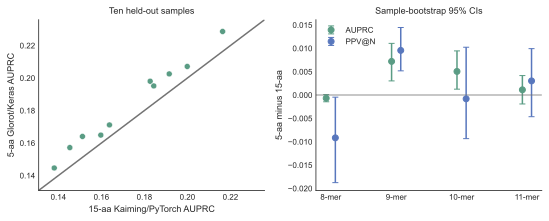
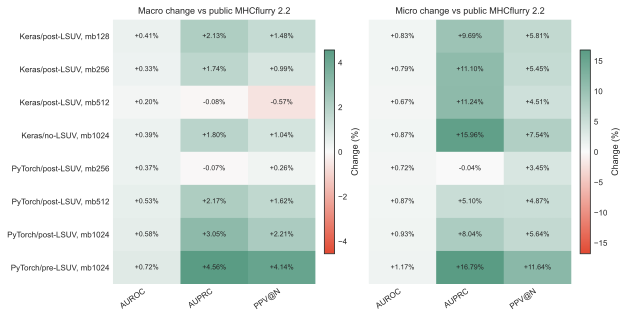

# Reproducible retraining of MHCflurry: framework semantics, optimization, and antigen context

> **Living manuscript draft (2026-09-03).** The controlled affinity frontier is
> complete. External-baseline rendering, terminal artifact retrieval, and
> end-to-end presentation validation remain in progress; the affinity result
> reported here will not become a release claim until those gates pass.

## Abstract

Reimplementing a trained predictor in a new neural-network framework can change
its optimization trajectory even when named hyperparameters appear identical.
We audited the MHCflurry 2.1.x training recipe during preparation of version
2.3.0 and identified differences in weight and bias initialization,
data-dependent initialization, optimizer equations, validation splitting, and
random-number handling. We restored explicit compatibility settings and used
frozen, provenance-tracked benchmarks to separate their effects from batch
size, neural architecture, and antigen-flank context. Initial paired affinity
experiments showed that minibatch size interacted strongly with RMSprop's
epsilon placement and with LSUV's activation boundary; none of those initial
departures improved both macro- and micro-averaged AUPRC and PPV@N over the
historical Keras-compatible recipe. In antigen-processing models, optimizer and
initializer effects reversed across architectures and flank lengths. The final
affinity frontier nevertheless identified a jointly favorable interaction:
native PyTorch RMSprop, pre-activation LSUV, and minibatch 1024 improved all six
macro- and micro-averaged metrics relative to public MHCflurry 2.2, including
4.56% macro AUPRC and 16.79% micro AUPRC. Five
residues on each side of the peptide outperformed 15-residue flanks by 5.79%
macro AUPRC and 3.87% macro PPV@N, winning both metrics in all ten held-out
samples. Position-wise non-convolutional controls failed decisively, supporting
the continued use of convolution. End-to-end presentation validation remains
in progress. These results show that
framework-semantic parity is an empirical requirement and that training choices
should be selected at the component and architecture level rather than treated
as universal defaults.

## Introduction

MHC class I presentation prediction combines peptide-MHC binding affinity with
features of antigen processing. The release model is therefore sensitive to
both the scientific training recipe and low-level implementation details. A
framework port can preserve labels such as “RMSprop,” “Adam,” “Glorot,” and
“LSUV” while changing the equations or tensors to which those operations apply.
Such drift is especially difficult to diagnose when it is coupled to more data,
larger minibatches, new execution hardware, or altered ensemble selection.

We used the MHCflurry 2.3.0 retraining effort as a controlled study of these
interactions. Our primary goals were to (1) recover the published 2.1.x recipe
as an explicit baseline, (2) test proposed departures one factor at a time on
identical held-out rows, (3) determine which findings generalize across model
architectures and biological input contexts, and (4) preserve sufficient
predictions, metrics, training traces, hashes, and source archives to reproduce
every figure.

## Methods

### Compatibility audit

We compared the v2.1.5 release generators with the 2.3.0 PyTorch
implementation at the layer, optimizer, validation, and data-generation levels.
The full audit is maintained in
[`release_neural_hyperparameter_audit.md`](release_neural_hyperparameter_audit.md).
The compatibility baseline uses Glorot-uniform kernels and zero biases,
post-activation LSUV, Keras-compatible RMSprop for affinity, Keras-compatible
Adam for processing, Keras validation-split rounding, and the historical
component-specific minibatches (128 affinity; 512 processing). Release runs use
seed 42, eager execution, and highest float32 matrix-multiplication precision.

### Affinity experiments

The representative affinity panel uses one feedforward architecture
(`[512, 512]`) and one skip-connected architecture (`[256, 512, 512]`), both
with L1 penalty `1e-8`, across four folds. Earlier paired experiments compared
Keras- and PyTorch-style RMSprop, pre- and post-activation LSUV, disabled LSUV,
and minibatches 128 and 1024. The terminal frontier expands this to eight
conditions and 64 networks: Keras/post-LSUV minibatches 128, 256, and 512;
PyTorch/post-LSUV minibatches 256, 512, and 1024; PyTorch/pre-LSUV minibatch
1024; and Keras/no-LSUV/Glorot minibatch 1024.

Affinity evaluation uses the frozen 15,027,952-row monoallelic benchmark.
Candidate models are compared directly with the public 2.2
`models.no_additional_ms` ensemble after excluding the union of candidate and
public affinity-training peptide-MHC pairs. Saved predictions from all
candidates are row-identity checked and joined one-to-one with NetMHCpan 4.0 BA,
NetMHCpan 4.0 EL, and MixMHCpred scores.

### Processing experiments

The processing panel uses a shared 399,392-row training table derived from 100
samples, four folds, and ten held-out samples per fold. It crosses two
representative convolutional architectures with Glorot versus Kaiming
initialization and Keras-compatible versus native PyTorch Adam. The smaller
architecture uses tanh, 256 filters, kernel width 11, an 8-unit dense layer,
dropout 0.3, and no convolutional L1 penalty. The larger architecture uses
ReLU, 512 filters, kernel width 17, a 16-unit dense layer, dropout 0.5, and
convolutional L1 `1e-6`. All comparisons hold learning rate 0.001, minibatch
512, training rows, folds, seeds, decoy generation, and the public affinity
predictor fixed.

We evaluated no flanks, five residues per side, and 15 residues per side. A
separate topology ablation replaced convolution with either a shared
position-wise dense transform or a parameter-matched position-wise multilayer
perceptron while preserving the downstream cleavage, pooling, and flank heads.

### Metrics and statistical unit

Primary metrics are AUROC, area under the precision-recall curve (AUPRC), and
positive predictive value among the top *N* predictions (PPV@N), where *N* is
the number of observed positives. Macro values average over alleles for
affinity and samples for processing; micro values pool prediction rows. Paired
sample signs are reported for processing. Peptide-length uncertainty is
estimated by bootstrapping the ten held-out samples, rather than treating
millions of peptide rows as independent observations.

### Reproducibility

Every experiment records the training source commit, evaluation source commit,
source archive, launch command, hyperparameter YAML, input hashes, fold/model
manifests, stdout/stderr logs, per-epoch histories, row-level held-out
predictions, derived metrics, and terminal status. Figures 1–3 are regenerated
directly by
[`render_release_experiment_paper_figures.py`](../scripts/training/render_release_experiment_paper_figures.py);
the command writes a SHA256 manifest for every source and output file. The
terminal affinity snapshot will provide Figure 4 without manual transcription.

## Results

### Affinity settings are coupled rather than independently rankable

Figure 1 summarizes the completed paired affinity experiments relative to
Keras-compatible RMSprop, post-activation LSUV, and minibatch 128. Keras
RMSprop at minibatch 1024 reduced macro AUPRC by 5.20% and macro PPV@N by
4.31%. Moving LSUV to the pre-activation tensor produced a larger loss. Native
PyTorch RMSprop at minibatch 1024 was almost neutral by macro metrics but lost
3.08% micro AUPRC; at minibatch 128 it lost 9.53% micro AUPRC. Disabling LSUV
was mixed, improving micro AUPRC while reducing macro AUPRC. Thus optimizer
equations, initialization boundary, batch size, and aggregation level interact.

**Figure 1. Affinity training-recipe interactions.** Percent changes are from
paired prediction tables on identical held-out rows. The historical
Keras/post-LSUV/minibatch-128 condition is the zero reference and is omitted.

### Processing effects reverse across flank contexts

No alternative initializer/optimizer pair dominated the processing panel
(Figure 2). Kaiming with Keras Adam improved no-flank macro AUPRC by 2.03% but
reduced five-residue-flank AUPRC by 2.16%. Kaiming with native Adam improved
15-residue-flank macro AUPRC by 1.99% but reduced five-residue-flank AUPRC by
2.15%. Architecture stratification further showed opposite responses between
the small/tanh and large/ReLU networks. Consequently initialization and
optimizer remain architecture-level search axes; the frozen benchmark is not
used to splice an ensemble post hoc.

**Figure 2. Processing recipe interactions by flank context.** Percent changes
are relative to Glorot initialization with zero bias and Keras-compatible Adam.
All other training inputs and hyperparameters are fixed.

### Five-residue flanks provide the strongest aggregate processing signal

The selected five-residue Glorot/Keras ensemble exceeded the selected
15-residue Kaiming/native ensemble in all ten samples for AUPRC and PPV@N
(Figure 3). Macro AUPRC increased from 0.17330 to 0.18333 (+5.79%) and macro
PPV@N from 0.26165 to 0.27177 (+3.87%). The only statistically credible
15-residue advantage was PPV@N among 8-mers, a stratum containing 852 positives
(4.60% of positives). Nine-mers, which account for 68.91% of positives, favored
five-residue flanks for both primary metrics.

**Figure 3. Direct flank-context comparison.** Left: per-sample AUPRC on the
same ten held-out samples. Right: sample-bootstrap 95% confidence intervals for
the five-residue-minus-15-residue difference by peptide length.

### Local sequence mixing is essential

All 14 completed non-convolutional comparisons lost both AUPRC and PPV@N in all
ten held-out samples. Macro AUPRC losses ranged from 81.24% to 92.80%, and
parameter matching did not rescue the position-wise MLP. Convolution therefore
remains part of the release architecture. The result also explains why equal
parameter counts for five- and 15-residue inputs do not imply equal behavior:
convolutional weights are shared across positions, while the longer sequence
changes activation statistics and pooling opportunities.

### A native/pre-LSUV/minibatch-1024 interaction leads the affinity frontier

All 64 networks in the eight-condition frontier trained successfully. Direct
comparison with public MHCflurry 2.2 used the same 15,027,950 rows, 135,387
positives, and 95 alleles for every candidate after excluding two rows that
overlapped the union of candidate and public affinity-training data. Native
PyTorch RMSprop with pre-activation LSUV and minibatch 1024 led every other
condition on all six aggregate metrics (Figure 4). Relative to public 2.2,
macro AUROC, AUPRC, and PPV@N increased by 0.72%, 4.56%, and 4.14%; micro
AUROC, AUPRC, and PPV@N increased by 1.17%, 16.79%, and 11.64%.

This result is not evidence that pre-activation LSUV is universally superior.
Earlier Keras-RMSprop experiments found the opposite direction, while native
RMSprop with post-activation LSUV at minibatch 1024 achieved smaller gains
(3.05% macro AUPRC and 8.04% micro AUPRC). The frontier instead identifies a
specific three-way interaction among optimizer equations, the LSUV tensor, and
minibatch size. The native/pre-LSUV/minibatch-1024 recipe is therefore the
leading affinity release candidate, subject to external-baseline figures and
end-to-end presentation validation.

**Figure 4. Eight-condition affinity frontier.** Percent changes are computed
from direct candidate-versus-public prediction tables after applying the same
union-training-overlap exclusion. Macro values average over 95 alleles; micro
values pool all retained rows. Color scales differ between panels so that the
smaller macro differences remain visible.

## Discussion

The experiments reject two tempting universal rules. First, a larger minibatch
is not intrinsically better or worse: its effect depends on the optimizer
equation and initialization procedure. Second, a modern initializer or native
framework optimizer is not intrinsically preferable after a framework port.
The correct default depends on the model component, neural architecture, and
biological input context. For affinity, the complete interaction happened to
favor the native optimizer, pre-activation LSUV, and the largest tested
minibatch; for processing, the five-residue release baseline remains Glorot
initialization with zero bias and Keras-compatible Adam.

For release engineering, the conservative rule is to restore historical
semantics unless a controlled comparison supports a departure. For future
searches, initializer and optimizer should remain serialized hyperparameters,
but regions that fail consistently—such as non-convolutional processing and
non-baseline recipes for the small five-residue-flank network—can be pruned.
Execution-only controls such as prediction chunk size and worker count remain
outside model provenance, provided that they pass numerical-parity tests and
never silently shrink the configured scientific minibatch.

## Limitations

The processing development benchmark has been queried repeatedly during model
selection and is not an untouched confirmatory test. Several experiments use
two representative architectures rather than the full release grid. The
external affinity comparisons and the selected affinity/processing models must
still pass end-to-end presentation validation. We will distinguish exploratory,
development, and confirmatory evidence in the final manuscript and release
notes.

## Data and code availability

The current paper-figure sources are the archived affinity runs
`release-2.3.0-affinity-ablations-5c0b7fcaf-run1` and
`release-2.3.0-affinity-native128-33010036e-run1`, and the processing run
`release-2.3.0-processing-ablations-33010036e-run3`. The terminal affinity
frontier was trained from commit `ac812c1cdabc6e84d515213fa1ba59341f9ca83b`;
the combined renderer is commit
`0b88690040feb9f5e46826fdb6dad91146b2654a`. A final artifact table with
snapshot paths and SHA256 digests will be added after retrieval.
